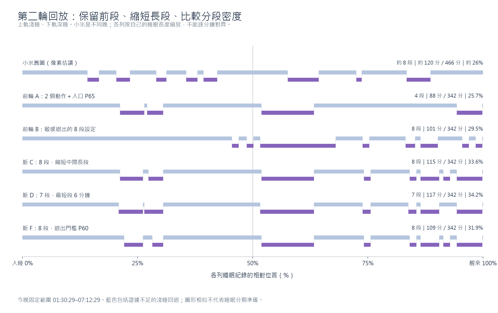

# 2026-10-02 第二輪離線回放：細化兩個偏好的分段方案

本輪依使用者對前輪 A（88 分鐘／4 段）與 B（101 分鐘／8 段）的形態偏好，完成 **1,268 組不同設定**。保留前輪報告與資料，正式 App 仍為規則 11。本報告選出 C、D、E、F 四組供比較，沒有把小米圖輸入演算法或以固定週期／段數補出深睡。

**較符合這次形態偏好的組合是 C：115 分鐘／8 段，最長段 39 分鐘；D 則是最短段至少 6 分鐘的 117 分鐘／7 段選項。** 這是同一份分鐘摘要的工程敏感度分析，不是已驗證的生理分期。

圖中上軌是淺睡輸出、下軌是深睡輸出。淺睡包含證據不足及短段過濾後的回退；小米是另一天、466 分鐘的舊圖，其他各列都是今晚固定的 342 分鐘。每列按自身時長縮放，不能將相同 x 座標當成同一時刻。

## 主要結果

| 組合 | 深睡分鐘 | 段數 | 占今晚時長 | 最長段 | 段長中位數 | 前半夜深睡 | ≤5 分鐘段數 | 相隔 ≤2 分鐘的段落對數 |
| --- | ---: | ---: | ---: | ---: | ---: | ---: | ---: | ---: |
| 前輪 A：2 個動作＋入口 P65 | 88 | 4 | 25.7% | 39 | 18.5 | 30 | 0 | 1 |
| 前輪 B：多項放寬＋敏感退出 | 101 | 8 | 29.5% | 56 | 5 | 約 9.5 | 5 | 0 |
| **新 C：8 段、較短的中間長段** | **115** | **8** | **33.6%** | **39** | **12.5** | **28** | **3** | **0** |
| **新 D：最短段至少 6 分鐘** | **117** | **7** | **34.2%** | **40** | **14** | **32** | **0** | **1** |
| 新 E：較少切換 | 123 | 6 | 36.0% | 40 | 16.5 | 33 | 0 | 0 |
| 新 F：退出條件較敏感 | 109 | 8 | 31.9% | 39 | 11 | 22 | 3 | 0 |

前半夜定義為固定 session 的前半：01:30:29.427–04:21:29.427。小米舊圖只能估讀：8 段、約 26%、中位段長約 13 分鐘、最長約 31 分鐘。新 C 的段長和分布比前輪 B 更符合本次偏好，但比例升到 33.6%，並沒有在所有指標上都更接近小米；A 的比例仍最接近。

## 各方案的實際門檻

以下 A–F 都使用 2 個合格動作建立支持、底噪倍數 3.0、支持期限 45 分鐘、入口 RMS 百分位 P65、退出 RMS 最近 5 分鐘中位數，以及最近 5 分鐘動作事件數 8 的既有退出條件。未啟用獨立放寬續期或 composite handling。其他欄位如下：

| 門檻 | A | B | C | D | E | F |
| --- | ---: | ---: | ---: | ---: | ---: | ---: |
| 單峰值 handling 重設門檻（m/s²） | 1.5 | 3.0 | **2.5** | **2.5** | **2.5** | **2.5** |
| 深睡入口窗口（分鐘） | 15 | 10 | **15** | **14** | **14** | **15** |
| 退出 RMS 門檻（當晚百分位） | P70 | P50 | **P65** | **P67** | **P70** | **P60** |
| 連續超標窗口數 | 3 | 1 | **2** | **2** | **2** | **2** |
| 最短深睡段（分鐘） | 10 | 5 | **5** | **6** | **6** | **5** |

超標窗口每分鐘更新且互相重疊，2 次不代表兩個獨立五分鐘區間。百分位門檻由該組可用基準摘要計算，不是目標深睡百分比。峰值 handling 門檻只調 `maxDelta` 分支；平均 RMS、姿態差值的 1.5 m/s² 硬門檻仍保留。

這些調整沒有改變感測頻率、資料缺口品質、手機使用排除、session 起訖或 55% 安全上限。四個新候選的 safety-cap 裁切均為 0。

## 新 C 的八段及結束原因

| 起訖 | 長度 | 結束原因 |
| --- | ---: | --- |
| 02:43–03:00 | 17 分鐘 | 近期 RMS 連續超過退出門檻 |
| 03:04–03:15 | 11 分鐘 | 床面支持到期，`COUPLING_EXPIRED` |
| 04:28–05:07 | 39 分鐘 | 床面支持到期，`COUPLING_EXPIRED` |
| 05:44–05:49 | 5 分鐘 | 近期 RMS 連續超過退出門檻 |
| 06:18–06:23 | 5 分鐘 | 近期 RMS 連續超過退出門檻 |
| 06:26–06:40 | 14 分鐘 | 近期 RMS 連續超過退出門檻 |
| 06:43–06:48 | 5 分鐘 | 近期 RMS 連續超過退出門檻 |
| 06:53–07:12 | 19 分鐘 | session 尾端部分分鐘不能使用完整分鐘分期，`MISSING_MOTION` |

因此這八段不能全部稱為「觀測到了八次生理階段轉換」。03:15、05:07 是工程支持期限；07:12 是部分分鐘處理，並非感測器突然沒有資料。其他結束原因雖來自動作 RMS，也不等於已驗證的生理淺睡。

C 有 205 分鐘通過分期資格；最終回退 Light 共 139 分鐘，包含 137 分鐘不具資格及 2 分鐘短段撤回。其他合格 Light 為 88 分鐘。三個 5 分鐘段剛好達保留下限，下面的相鄰門檻比較揭示其敏感性。

## 相鄰門檻會如何改變 C

下表以 C 為起點，每列只改指定項目：

| 改動 | 結果 | 解讀 |
| --- | --- | --- |
| 單峰值門檻 2.5→2.25 | 115 分鐘／8 段，起訖完全相同 | 這一小段參數範圍內結果不變 |
| 單峰值門檻 2.5→2.75 | 157 分鐘／10 段，最長 67 分鐘 | 更容易保留大型短動作，明顯拉長深睡；不作本輪優先方案 |
| 退出 P65→P62 | 112 分鐘／8 段 | 前半夜縮短 3 分鐘，最長仍 39 分鐘 |
| 退出 P65→P60 | **F：109 分鐘／8 段** | 前半夜縮短 6 分鐘，最長仍 39 分鐘 |
| 入口 15→14 分鐘 | 119 分鐘／8 段，最長 40 分鐘 | 更早進入部分段落，增加 4 分鐘 |
| 入口 15→13 分鐘 | 122 分鐘／8 段，最長 41 分鐘 | 進一步延長部分段落 |
| 最短段 5→6 分鐘 | 100 分鐘／5 段 | 三個 5 分鐘段全部被刪除，並非自然長成較長段 |

這表示 C 對峰值 2.25–2.5、退出 P60–P65 尚有相近分布，但八段的數量依賴 5 分鐘保留下限。D 同時把入口改為 14 分鐘、退出改 P67、最短段設為 6 分鐘，可保留兩段 6 分鐘短段及五段更長的段落；它仍是另一個設定，不能宣稱解決所有邊界敏感性。

## D、E、F 的起訖

- **D（7 段／117 分鐘）**：02:42–03:00、03:01–03:15、04:27–05:07、05:43–05:49、06:17–06:23、06:26–06:40、06:53–07:12。前兩段只隔 1 分鐘，詳看圖時應一併考量。
- **E（6 段／123 分鐘）**：02:42–03:15、04:27–05:07、05:39–05:50、06:17–06:23、06:26–06:40、06:53–07:12。退出較寬，前兩段合併成 33 分鐘。
- **F（8 段／109 分鐘）**：02:46–03:00、03:07–03:15、04:28–05:07、05:44–05:49、06:18–06:23、06:26–06:40、06:43–06:48、06:53–07:12。

若優先保留較多明顯分段，可以繼續看 C／F；若希望少一些恰好五分鐘的小段，可以看 D。這是依本次圖形偏好作的比較，尚不選定正式上線門檻。

## 本輪搜尋及驗證

先比較 A、B 的單因子鄰域，再測組合及 C 鄰近設定，去除相同參數組後共 1,268 組。範圍包含入口 P55–P70、退出 P50–P75、入口 10–15 分鐘、最短段 5–10 分鐘、1–3 次退出確認、3／5／7 分鐘退出 RMS 窗口，以及動作底噪、續期、支持時限與峰值重設門檻。不是所有維度的全排列，也沒有保證找到全域最佳。

退出 RMS 窗口是本輪新增的單獨實驗參數；縮短時只影響 rolling RMS，既有活動分鐘及密集動作仍看原本最近五分鐘。百分位使用完整基準樣本線性插值，沒有把 P60／P62／P67 近似成既有欄位。

- 正式規則逐段重現 CSV，生成副本預設值與正式程式一致。
- 前輪 A／B 的完整 LIGHT／DEEP 起訖與第一輪報告完全一致。
- **44 項 JVM tests 通過**，包含新回放測試 1 項與既有 43 項，0 failure／error／skip。
- 全部 1,268 組通過時間守恆、分期資格、最短段與靜止／手機使用／錄製邊界／缺口反例。
- 原始碼 SHA-256 與輸入來源見 `manifest.json`。正式演算法、手機、取樣與同步未更動。

## 檔案與重現

- `comparison.csv`：全部設定、時長、段數、比例、段長、前半夜、短段與短間隔數量。
- `anchor-one-factor.csv`：A／B 及各自單一門檻改動，方便隔離效果。
- `selected-profiles.json`：A–F 的完整門檻與結果。
- `selected-intervals.csv`：A–F 每段起訖、長度、退出原因、主因及耦合原因。
- `intervals.csv`／`transitions.csv`：所有變體的完整區段、正式進出與後處理記錄。
- 重現命令及工具邊界見 [工具說明](../../tools/offline-replay/README.md)。第二輪使用 `--round 2` 及 `-DofflineReplayRound=2`，輸出獨立於第一輪。

固定輸入仍為 01:30:29.427–07:12:29.427 的已接受睡眠 session；沒有完整分類／使用原始資料，沒有回放候選選擇，也無法還原 01:27 前未取樣資料。只有一晚，沒有同晚小米或 PSG 標籤，這份報告只能支持形態、門檻敏感性及程式限制的比較。
