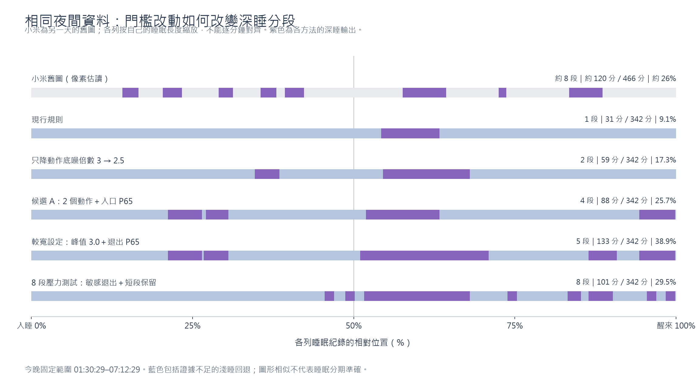

# 2026-10-02 真實 v7 夜間資料：離線門檻比較

## 結論

本晚最值得接續驗證的少量變更候選為：**建立床面支持需 3 個合格動作改為 2 個，深睡入口窗口 RMS 上限由當晚 P50 改為 P65**。其餘門檻維持現行規則。固定同一睡眠 session 的結果從 **31 分鐘／1 段**變成 **88 分鐘／4 段**，可分期時間由 61 增為 149 分鐘；深睡占比由 9.1% 變為 25.7%。

這是一個待驗證候選，尚未套用正式程式。小米舊圖像素估讀約 8 段、深睡占比約 26%；不同夜晚、不同時長，比例相近和分段增加都不能證明準確度。不能將小米當成這晚的逐分鐘標籤。

## 輸入與可驗證範圍

- CSV：`sleeptrace_motion_2026-10-02.csv`，376 個分鐘列、134 欄、feature v7、已保存與重算規則皆 11。第一筆 raw event 為 01:27:29；固定 session 為 01:30:29.427–07:12:29.427，共 342 分鐘。
- session 內感測覆蓋 99.912777%；這個比例不包含更早可能已入睡但尚未取樣的時段。不能補回 01:27 前資料或據此改變入睡／起床時間。
- 正式原始碼以目前工作區規則 11 為準（HEAD `334210f`；既有首頁 UI 工作尚未提交）。測試前後演算法來源 SHA-256 相同，詳見 `manifest.json`。
- CSV 六位小數摘要回放逐段重現原結果；每分鐘 canStage、formal action、coupling state／age 亦相同。實驗副本的預設分段、action、primary reason 與正式程式相同。
- CSV 未包含完整 Google 分類與 UsageStats 原始輸入；本實驗固定已接受睡眠範圍，以覆蓋該範圍的 SleepSegment 還原睡眠證據，沒有重跑候選選擇或同步。所有變體均使用相同還原輸入。

## 單一門檻改動

下表每一列均只改該項，其餘維持基準。

| 改動 | Deep 分鐘 | 段數 | 可分期分鐘 | 觀察 |
| --- | ---: | ---: | ---: | --- |
| 現行規則 | 31 | 1 | 61 | 04:36–05:07 |
| 深睡入口窗口 15→10 分鐘 | 33 | 1 | 61 | 幾乎不能改善分段 |
| 入口 RMS 上限 P50→P65 | 38 | 1 | 61 | 增加 7 分鐘，仍一段 |
| 入口 RMS 上限 P50→P70 | 39 | 1 | 61 | 增加 8 分鐘，仍一段 |
| 合格動作數 3→2 | 39 | 1 | 149 | 放行更多時間，但仍需要合適入口條件 |
| 動作底噪倍數 3→2.5 | 59 | 2 | 121 | 小動作較容易建立／續期；降至 2.0 本晚相同 |
| 僅續期底噪倍數改 2.5 | 46 | 1 | 78 | 主要延長既有一段 |
| 支持期限 45→60 分鐘 | 46 | 1 | 78 | 與單純續期放寬類似；90 分鐘本晚也相同 |
| 單峰值重設門檻 1.5→2.5 m/s² | 54 | 2 | 151 | 另有 11 分鐘候選被最短段過濾 |
| 單峰值重設門檻 1.5→3.0 m/s² | 116 | 3 | 198 | 出現 76 分鐘長段，形態不一定更好 |
| 峰值重設另需活動時長／姿態支持 | 70 | 2 | 152 | 有效，但僅憑此夜不能確認 handling 誤判 |
| 最短 Deep 段 10→5 或 2 分鐘 | 31 | 1 | 61 | 基準沒有短段可救回，單改無效 |
| 退出 RMS P70→P65／P50 | 23 | 1 | 61 | 7 分鐘短段被過濾，Deep 反而減少 |
| 退出超標窗口數 3→2／1 | 31 | 1 | 61 | 本晚基準無變化 |
| 退出動作數 8→6／4 | 31 | 1 | 61 | 本晚基準無變化 |

P65 是當晚合格基準樣本之 RMS 第 65 百分位數，不是要求 65% 時間輸出深睡。調整支持也會改變基準樣本集合，所以組合結果不能用單因子增加量直接相加。

## 候選 A：兩個門檻的小幅組合

設定 ID：`grid_n2_noise3.0_peak1.5_h45_w15_p65_x70`。

- 合格動作分鐘數 3→2；FAST 至少 20 分鐘歷史、首末跨度 ≥8 分鐘，SPARSE 至少 40 分鐘歷史、首末跨度 ≥30 分鐘仍保留。
- 15 分鐘入口窗口的 RMS 中位數上限 P50→P65；近期 5 分鐘 P70 檢查、活動比例／事件數、品質、Sleep API 起點證據及其他入口條件保留。
- 支持期限仍為 45 分鐘，峰值 handling 門檻仍為 1.5 m/s²；Deep 最短段仍 10 分鐘，退出仍為 P70／3 個連續超標窗口。

| 深睡起訖 | 長度 |
| --- | ---: |
| 02:43–03:01 | 18 分鐘 |
| 03:03–03:15 | 12 分鐘 |
| 04:28–05:07 | 39 分鐘 |
| 06:53–07:12 | 19 分鐘 |

總 Deep 88 分鐘／4 段，無 safety cap 裁切、無短段過濾；前半睡眠有 30 分鐘 Deep。可分期為 149／342 分鐘（43.6%），仍有 193 分鐘回退 Light。其段長中位數 18.5 分鐘、最長 39 分鐘，仍比小米舊圖估讀的中位約 13 分鐘／最長約 31 分鐘偏長，不能稱為已完整貼近。

這個候選增加深睡資格的代價，是只需兩個合格動作即可相信床面支持；原本被三個動作門檻排除的偶發震動，可能更容易通過。現有反例測試不等於已量測真實偽陽性率。

## 更多段數不一定更接近整體形態

| 組合 | Deep／段數 | 最長段 | 問題 |
| --- | --- | ---: | --- |
| 候選 A，再把峰值門檻提高至 3.0、退出改 P65 | 133 分鐘／5 段 | 68 分鐘 | 深睡 38.9%，長段更長，且 35 分鐘短候選被刪除 |
| 底噪 2.5、入口 P65、退出 P50／2 次、最短段 5 分鐘 | 73 分鐘／6 段 | 20 分鐘 | 主要集中在 03:28–05:22，沒有補出夜晚其他位置的段落 |
| 2 個動作、峰值 3.0、入口 10 分鐘／P65、退出 P50／1 次、最短段 5 分鐘 | 101 分鐘／8 段 | 56 分鐘 | 段長中位數只有 5 分鐘、前半夜只有約 9.5 分鐘 Deep，39 分鐘候選被短段過濾 |
| 2 個動作、峰值 3.0、入口 P65、最短段 5 分鐘，其餘原值 | 168 分鐘／8 段 | 68 分鐘 | 深睡 49.1%，段數相同但占比與長段皆相差大 |

部分敏感退出組合讓入口允許 RMS ≤P65、退出卻在 RMS >P50 就觸發，兩者範圍重疊，容易產生反覆進出。最激進的已測組合達 25 段，這是狀態機碎裂，不能因段數增加就採用。

候選 A 保留入口 P65、退出 P70 的分離，調整項目較少，也保留 10 分鐘最短段；因此較值得在其他夜晚驗證。這是根據變更幅度、可解釋性與已觀察副作用所作的工程選擇，沒有聲稱其為全域最佳或已校準。

## 小米舊圖的估讀方法

原圖 868×1886，深睡軌道掃描列 y=1648，另核對 y=1646／1650 都有 8 段；軌道 x=48–819。以顯示睡眠時長 466 分鐘換算，約 120 分鐘 Deep、26%、中位段長約 13 分鐘、最長約 31 分鐘；約一半 Deep 位於相對前半夜。邊緣有約 1–2 像素讀值誤差，不能當成精確分鐘。

圖表按每列自己的睡眠範圍縮放至 0–100%。小米不是同晚，不能把相同 x 座標視為同一時刻；也沒有把截圖輸入 JVM 演算法或指定目標比例／段數。像素數據與來源 SHA-256 在 `xiaomi-reference.json`。

## 驗證及檔案

- 383 次回放，362 組不同設定，含重複對照；每組均通過時間守恆、分期資格、最短段檢查，以及靜止、手機使用、錄製邊界和缺口反例。
- JDK 21：44 項 JVM tests 通過、0 failure／error／skip，包含實驗回放 1 項及既有相關測試 43 項。結果在 `test-results.json`／`verification.txt`。
- `comparison.csv`：全部設定、Deep 分鐘／段數／占比、可分期與回退分鐘、前半夜 Deep、段長及實際起訖。
- `intervals.csv`：每組完整 LIGHT／DEEP 時間線。`transitions.csv`：ENTER／EXIT 及後處理撤回記錄。
- 重現流程及全部參數定義見 `../../tools/offline-replay/README.md`。
- 正式演算法、App 版本、感測政策、資料庫、同步與手機均未更動。本次沒有 APK 或實機驗證，也不能推論生理準確度、真實偽陽性率或其他夜晚表現。
